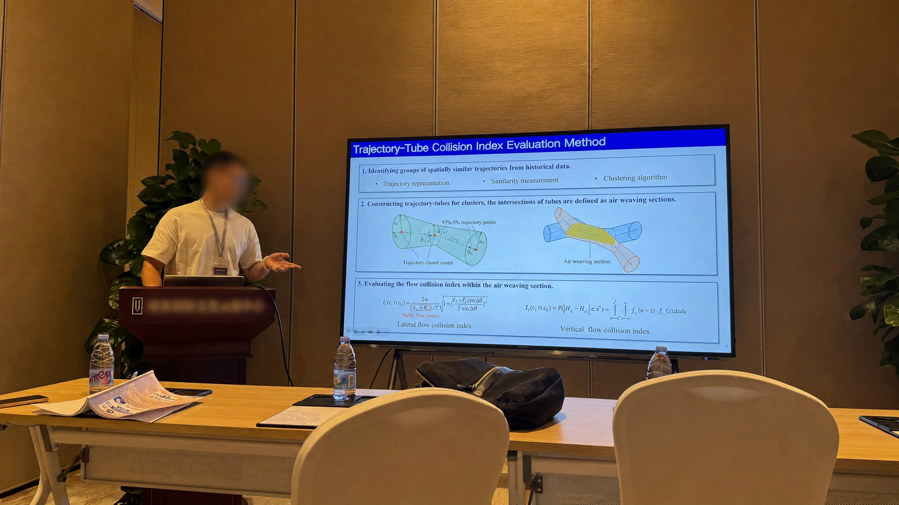
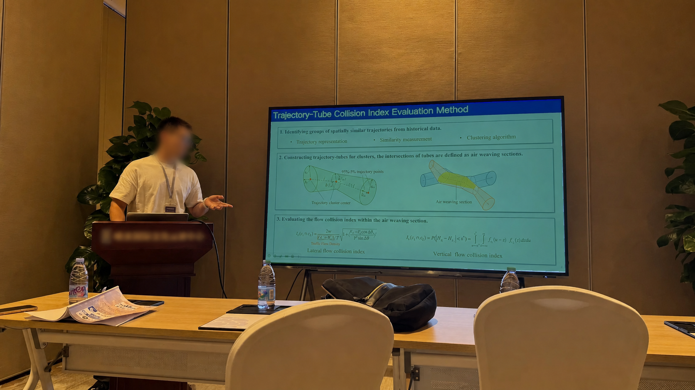
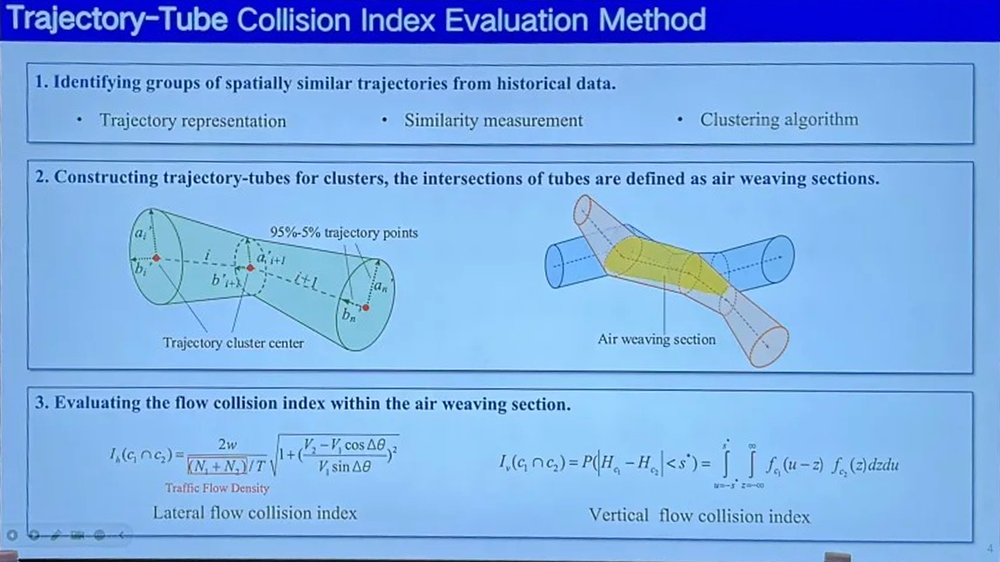
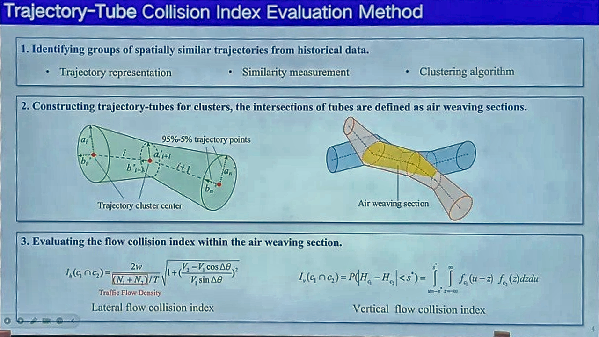
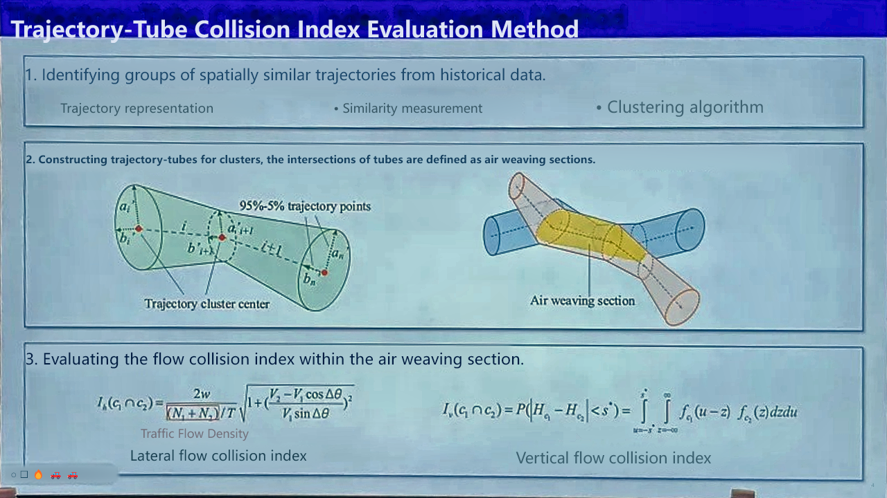
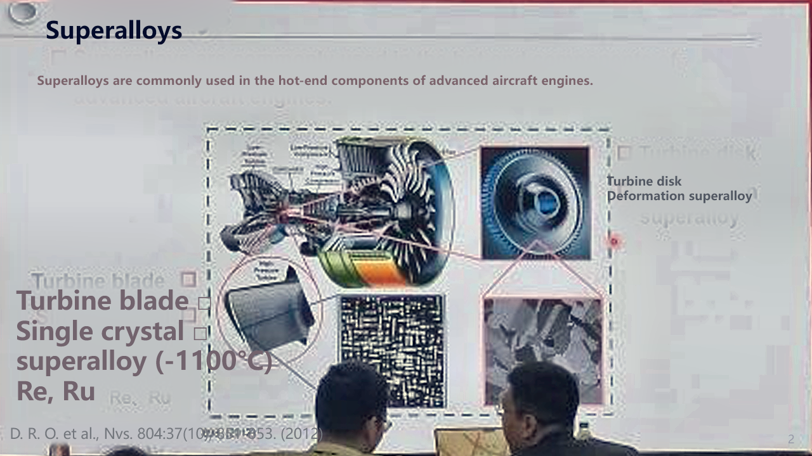
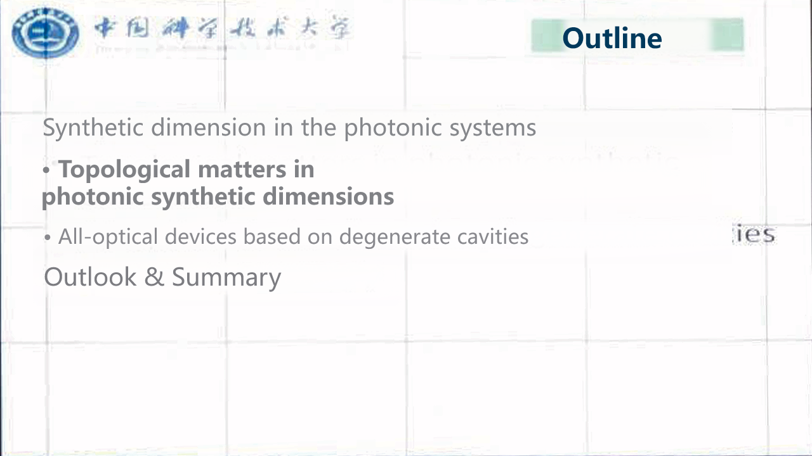

# Photo2slides

把会议现场拍摄的投影照片恢复为校正后的、可继续编辑的 PowerPoint。

Photo2slides 先用自训练的 YOLO 分割模型定位屏幕并完成透视校正，再用本地 PaddleOCR-VL 1.6 理解版面：标题、正文等内容会重建为原生文本框，简单矩形会重建为形状，图表、公式和复杂示意图则保留为可移动的独立图片。默认流程完全在本地运行，不需要 API Key。

## 效果

`原始照片 → 屏幕分割定位 → 透视校正 → 图像增强 → 可编辑幻灯片重建`

| 处理流程 | 实际处理结果 |
| --- | --- |
| **① 原始现场照片** |  |
| **↓ ② YOLO 屏幕分割定位**<br>识别投影屏幕区域并拟合边界。 |  |
| **↓ ③ 透视校正**<br>按照屏幕四角恢复为 16:9 正视图。 |  |
| **↓ ④ 图像增强**<br>调整颜色、对比度和清晰度，为页面理解提供输入。 |  |
| **↓ ⑤ 幻灯片重建**<br>重建文本与视觉元素并写入 PPTX。 |  |

## 功能

- YOLO 屏幕分割、四边形拟合与透视校正
- 自动增强颜色、清晰度并生成 OCR 输入
- PaddleOCR-VL 页面理解与中英文文本识别
- `editable`、`hybrid`、`image` 三种 PPTX 输出模式
- 输出逐页预览、中间结果和 QA 报告

## 快速开始

准备 Python（建议 3.11）、Node.js 和 npm。NVIDIA GPU 可显著加速页面理解，CPU 也能运行但速度较慢。

```bash
git clone https://github.com/JaylenVen/Photo2slides.git
cd Photo2slides
python -m pip install -r p2p/requirements-vision.txt
npm install --prefix p2p/src
```

把照片放入 `p2p/data/input/`，按自然顺序命名（如 `1.jpg`、`2.png`、`10.jpg`），然后在仓库根目录运行：

```bash
python p2p/src/photo_to_pptx.py
```

结果位于 `p2p/data/output/photo2slide-vlm.pptx`。首次运行还会下载 PaddleOCR-VL 及版面模型到本地缓存，因此需要联网并预留数 GB 磁盘空间。仓库已经包含运行所需的 YOLO 推理权重，不包含训练图片、标注或训练日志。

常用参数：

```bash
# 仅生成整页图片型 PPTX
python p2p/src/photo_to_pptx.py --ppt-mode image

# 指定输入与输出
python p2p/src/photo_to_pptx.py \
  --input-dir /path/to/photos \
  --output /path/to/slides.pptx

# 强制使用 CPU
python p2p/src/photo_to_pptx.py --analysis-device cpu
```

## 当前不足与跟进

- 遮挡、严重反光、过曝和低分辨率内容无法被真实还原；正在改进屏幕边界与质量评估。
- 复杂图表、公式和示意图目前主要作为图片保留；正在扩展原生图形与表格重建。
- OCR 可能出现文字、字体、行距和对齐偏差；正在优化中英文混排与版式匹配。
- 首次模型下载较大，CPU 推理较慢；正在评估更轻量的模型与缓存发布方案。

| 遮挡与文字重影 | 背景清除残留 |
| --- | --- |
|  |  |
| 人物遮挡的内容无法从单张照片中真实恢复，局部还会出现重复文字和错位。 | 背景文字清除不完整时，会留下淡色文字、网格或局部残片。 |

## 测试

```bash
python -m unittest discover -s p2p/tests -v
```
